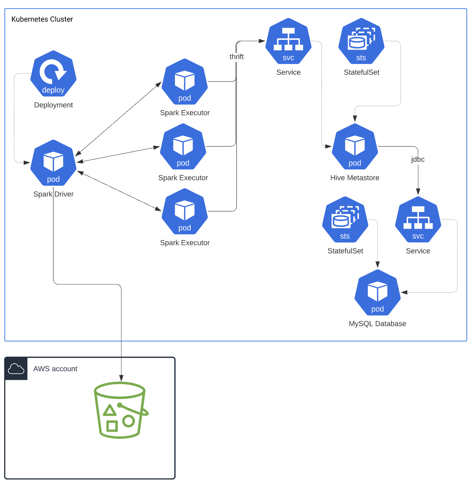

# lakehouse_research

## Docker container setup: Version Matrix
<table>
    <thead>
        <tr>
            <th>Resource</th>
            <th>Base Image</th>
            <th>Package</th>
            <th>Version</th>
            <th>Additional Comments</th>
        </tr>
    </thead>
    <tbody>
        <tr>
            <td>mysqldb</td>
            <td>mysql</td>
            <td>mysql</td>
            <td>8.0.27</td>
            <td></td>
        </tr>
        <tr>
            <td rowspan=3>hivemetastore</td>
            <td rowspan=3>openjdk:8-jre-slim</td>
            <td>Hadoop core</td>
            <td>3.2.2</td>
            <td></td>
        </tr>
        <tr>
            <td>Hive Standalone Metastore</td>
            <td>3.0.0</td>
            <td></td>
        </tr>
        <tr>
            <td>MYSQL Connector</td>
            <td>8.0.26</td>
            <td>debian package</td>
        </tr>
        <tr>
            <td rowspan=5>Spark driver</td>
            <td rowspan=5>openjdk:8-jre-slim</td>
            <td>Hadoop core</td>
            <td>3.2.2</td>
            <td></td>
        </tr>
        <tr>
            <td>Spark</td>
            <td>3.1.2</td>
            <td>Compiled for Hadoop 3.2 and higher</td>
        </tr>
        <tr>
            <td>Hive</td>
            <td>3.1.2</td>
            <td></td>
        </tr>
        <tr>
            <td>pyspark</td>
            <td>3.1.2</td>
            <td>pip install</td>
        </tr> 
        <tr>
            <td>jupyterlab</td>
            <td></td>
            <td>pip install</td>
        </tr>
        <tr>
            <td rowspan=4>Spark executor</td>
            <td rowspan=4>openjdk:8-jre-slim</td>
            <td>Hadoop core</td>
            <td>3.2.2</td>
            <td></td>
        </tr>
        <tr>
            <td>Spark</td>
            <td>3.1.2</td>
            <td>Compiled for Hadoop 3.2 and higher</td>
        </tr>
        <tr>
            <td>Hive</td>
            <td>3.1.2</td>
            <td></td>
        </tr>
        <tr>
            <td>pyspark</td>
            <td>3.1.2</td>
            <td>pip install</td>
        <tr>                                                       
    </tbody>
</table>

### High level deployment view:

